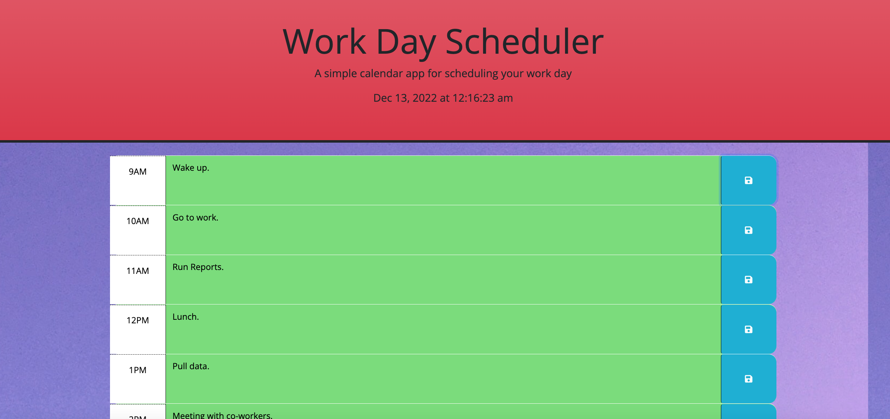
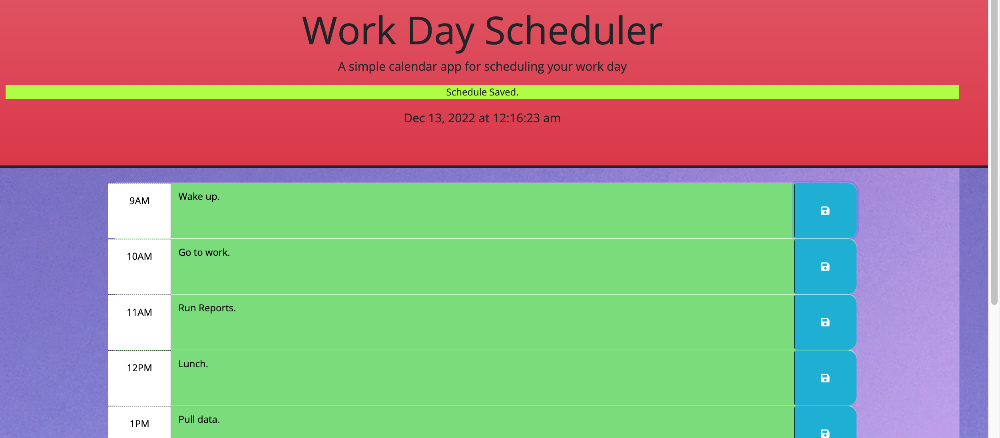
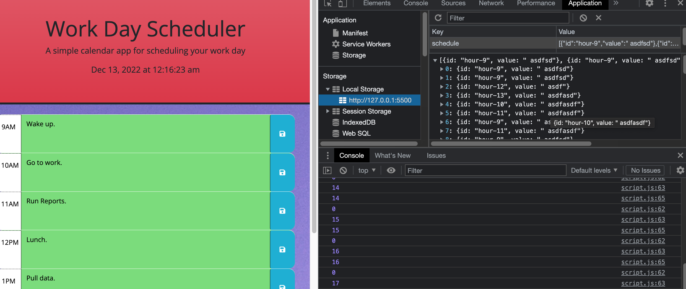

# day-calendar-scheduler
A nice way to schedule your day for showing all  past present and future events.

## Description

My motivation for this project was to practice more local storage and start using 3rd party API's. For this project I had to learn the syntax of both jQuery and bootstrap. jQuery has a much simpler syntax compared to the more vanilla version of JavaScript. Bootstrap is a nice tool to use for quick creation of forms and manipulating visual aspects of this project. This project solves the issue of manipulating elements and class to show different times throughout a work schedule. Whether it is in the past, present or future. Also I was able to create a function to show when the save button is pressed. In the end I learned a lot of valuable skills with 3rd party API's in order to create this scheduler.

## Deployed Site

[Day Calendar Scheduler](https://syntaxsemantixs.github.io/day-calendar-scheduler/)

## Table of Contents (Optional)

If your README is long, add a table of contents to make it easy for users to find what they need.

- [Installation](#installation)
- [Usage](#usage)
- [License](#license)

## Installation

To create the same project you will need to use these versions of jQuery, bootstrap, font awesome and google fonts:

jQuery:
https://code.jquery.com/jquery-3.4.1.min.js

boostrap: 
https://cdn.jsdelivr.net/npm/bootstrap@5.1.3/dist/css/bootstrap.min.css

Font Awesome: 
https://use.fontawesome.com/releases/v5.8.1/css/all.css

Google Fonts:
https://fonts.googleapis.com/css?family=Open+Sans&display=swap

## Usage

***Please keep in mind that when I took these photos the time was not past 9am causing all the times to become green.***

Main Page

Save Screen

Local Storage

## License

MIT License

Copyright (c) 2022 Gerardo

Permission is hereby granted, free of charge, to any person obtaining a copy
of this software and associated documentation files (the "Software"), to deal
in the Software without restriction, including without limitation the rights
to use, copy, modify, merge, publish, distribute, sublicense, and/or sell
copies of the Software, and to permit persons to whom the Software is
furnished to do so, subject to the following conditions:

The above copyright notice and this permission notice shall be included in all
copies or substantial portions of the Software.

THE SOFTWARE IS PROVIDED "AS IS", WITHOUT WARRANTY OF ANY KIND, EXPRESS OR
IMPLIED, INCLUDING BUT NOT LIMITED TO THE WARRANTIES OF MERCHANTABILITY,
FITNESS FOR A PARTICULAR PURPOSE AND NONINFRINGEMENT. IN NO EVENT SHALL THE
AUTHORS OR COPYRIGHT HOLDERS BE LIABLE FOR ANY CLAIM, DAMAGES OR OTHER
LIABILITY, WHETHER IN AN ACTION OF CONTRACT, TORT OR OTHERWISE, ARISING FROM,
OUT OF OR IN CONNECTION WITH THE SOFTWARE OR THE USE OR OTHER DEALINGS IN THE
SOFTWARE.